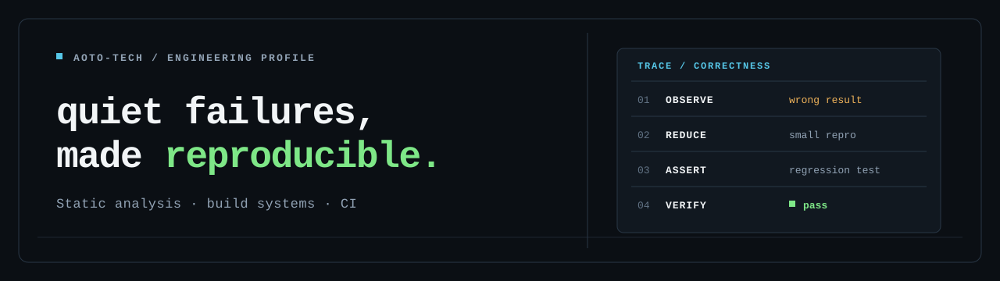

<p align="center">
  
</p>

Developer tooling, static analysis, and CI correctness.<br />
I work on bugs that leave the build green: wrong results, dropped data, and skipped analysis.

## Selected upstream fixes

### 01 / [Spotless — version catalog formatting](https://github.com/diffplug/spotless/pull/3042)

Prevented valid TOML entries and quoted content from being changed or dropped. <sub>MERGED</sub>

### 02 / [SpotBugs — SARIF source paths](https://github.com/spotbugs/spotbugs/pull/4296)

Made SARIF output survive unknown source paths without losing logical locations or printing exception traces. <sub>MERGED · 4.10.5</sub>

### 03 / [dbt-plan — pull-request CI](https://github.com/PresentJay/dbt-plan/pull/181)

Closed a path-inference gap that could let dbt changes skip generated CI. <sub>MERGED</sub>

## Building

### [CellFence](https://github.com/aoto-tech/CellFence)

Deterministic architecture guardrails for codebases changed by humans and coding agents. CellFence checks dependency boundaries, public API drift, undeclared resource access, and manifest changes that would self-approve architectural growth.

```text
code change ──▶ tests pass ──▶ types pass ──▶ boundary drift
                                                 │
                                          CellFence fails
```

Recent work: [14 analysis and governance fixes](https://github.com/aoto-tech/CellFence/pull/65) · [fail-closed scoped mutation testing](https://github.com/aoto-tech/CellFence/pull/7)

---

<sub>Mostly Java, Rust, TypeScript, and Python · <a href="https://github.com/search?q=author%3Aaoto-tech+is%3Apr&type=pullrequests">all pull requests ↗</a></sub>
