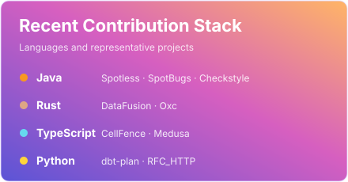

# Hi, I'm YukiAoto! 👋

Developer tooling, static analysis, build systems, and CI correctness.

## 👨‍💻 About Me

- I investigate wrong results, dropped data, and skipped analysis—especially bugs that leave the build green.
- I turn unexpected behavior into small reproductions and regression tests.
- I'm building [CellFence](https://github.com/aoto-tech/CellFence), deterministic architecture guardrails for codebases changed by humans and coding agents.

## 🤝 最近のコントリビュート履歴

- [**Spotless #3042**](https://github.com/diffplug/spotless/pull/3042) — Prevented valid TOML entries and quoted content from being changed or dropped. `merged`
- [**SpotBugs #4296**](https://github.com/spotbugs/spotbugs/pull/4296) — Preserved useful logical locations in SARIF when source paths are unknown. `merged · 4.10.5`
- [**dbt-plan #181**](https://github.com/PresentJay/dbt-plan/pull/181) — Fixed path inference that could let dbt changes skip pull-request CI. `merged`

## 💻 Languages

  

## 🛠️ Tools

  

## ⚡ GitHub Stats

  

<a href="https://github.com/search?q=author%3Aaoto-tech+is%3Apr&type=pullrequests">View all pull requests →</a>
